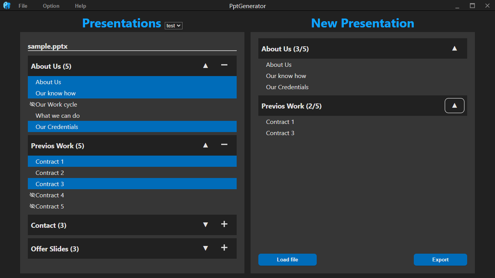

<!-- PROJECT LOGO -->
<br />
<div align="center">
        
    <h3 align="center">PptGenerator</h3>
    <p align="center">
        A software to manage huge PowerPoint slide collections.
        <br />
        <br />
        <a href="#">Report Bug</a>
        ·
        <a href="#">Request Feature</a>
    </p>
</div>

<br />
<br />
  
<div align="center">
    
</div>  

<br />
<br />

<!-- ABOUT THE PROJECT -->
## About The Project  

If you have a collection of PowerPoint slides that you will reuse for different presentation, you can easily create o new presentation with the slides from your collection.  

Features: 
* You can create a new presentation without opening PowerPoint
* You can easily select multiple slides from your collection
* You can use placeholders that will be replaced by the program
* You can save presentations as a preset and load them up again to change them
* You can load pptx files created with this program similar to presets (presets have smaller file size)

<br />

__IMPORTANT__  
All slides need to have a `UID`  
A UID is written in the notes a presentation and looks like this:  
```sh
  UID:LTCyabi1keUKQEvQd7aKnQ
  ```
Since the UIDs are required and every slide from your collections needs to a unique one, the program will check the UIDs and tells if the UIDs are missing or if there a duplicated ones. You will then have the ability to change them manually or let the program do it for you.

<br />

### Built With  

* [Electron](https://www.electronjs.org/)
* [Open XML SDK](https://docs.microsoft.com/de-de/office/open-xml/open-xml-sdk)

<br />

<!-- GETTING STARTED -->
## Getting Started

### Prerequisites  

* [Visual Studio](https://visualstudio.microsoft.com/)
* npm
  ```sh
  npm install npm@latest -g
  ```

### Installation  

1. Clone the repository
   ```sh
   git clone https://github.com/username/project-name.git
   ```

<br />

2. Install npm packages
   ```sh
   npm i
   ```

<br />

3. Create config.json in frontend/config/config.json with the following content:
   ```sh
   {
        "metaJsonPath": "",
        "metaPicsPath": "",
        "coreApplication": "",
        "presetPath": "",
        "basePath": "",
        "defaultExportPath": "",
        "backupPath": "",
        "presentationMasters": [],
        "ignoreHiddenSlides": true,
        "showTutorial": true
    }
    ```

<br />

4. Create the following folders and files in your project and set the location in the config:
    * A 'meta.json' file -> metaJsonPath
    * A 'pics' folder -> metaPicsPath
    * A 'preset' folder -> presetPath
    * A 'export' folder -> defaultExportPath
    * A 'backup' folder -> backupPath 

<br />

5. Build the C# project and set the path to the builded file to 'coreApplication'

<br />

6. You should now be able to start the application with:
   ```sh
   npm run start
   ```

<br />

7. To build/distribute the project use
   ```sh
   npm run dist
   ```

<br />

<!-- USAGE -->
## Usage  

<br />